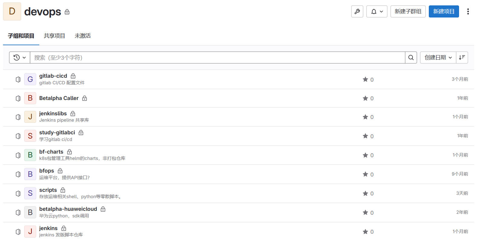

> 已清理掉重要的账号与密码，IP地址，客户等关键信息！！！
> 
> 已清理掉所有客户相关环境的部署资料等！！！

# 库说明

1. ck-charts，helm chart 代码仓库，通过 `helm package` 打包后，会提交到harbor仓库
2. gitlab-cicd，跑代码检查的库
3. jenkins-libs，Jenkins共享库，给Jenkins-pipeline提供公用的功能函数等
3. jenkins-pipeline，用Jenkins插件、shell脚本、groovy等组装的代码编译、打包、镜像制作与上传、多项目与多环境部署等功能。

## 实现功能

1. 基于Gitlab、gitlab-runner、sonarqube等的代码提交检查。
2. 基于Gitlab、Jenkins + Pipeline + Groovy + Jenkins共享库、Harbor、Docker + Compose 、K8S + Helm chart等实现的CI/CD持续构建、部署、更新等自动化。

## others

原devops代码仓库组，各子仓库截图

